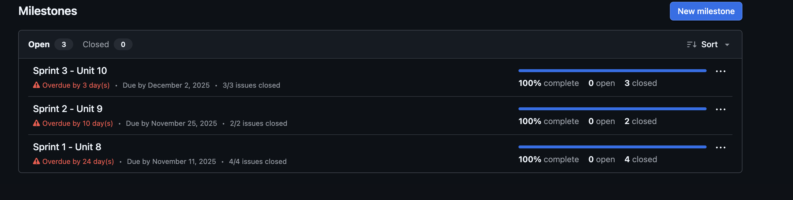
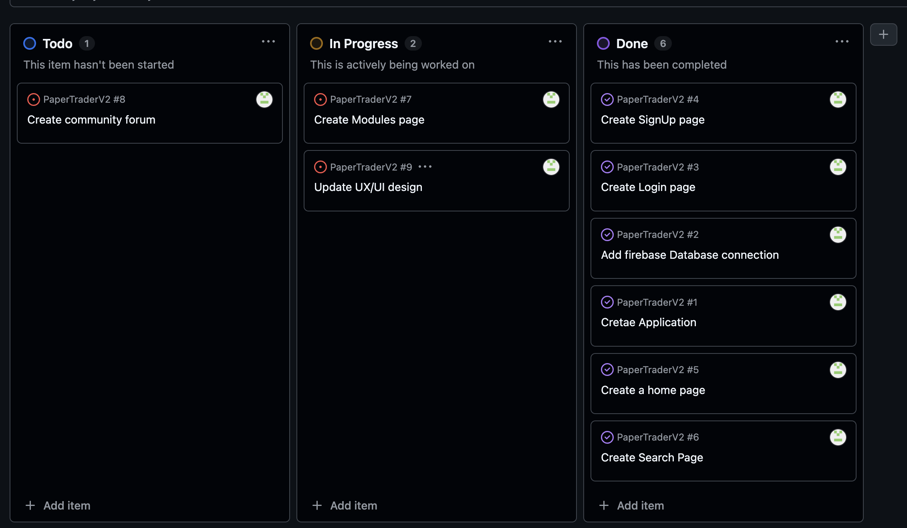
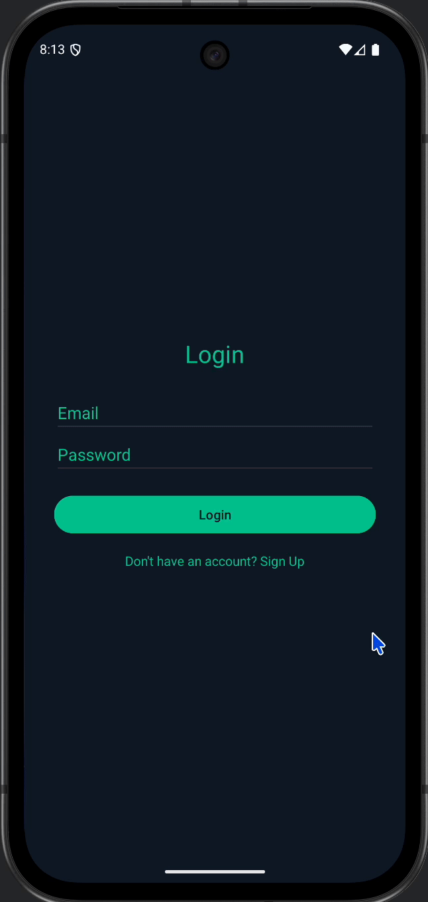
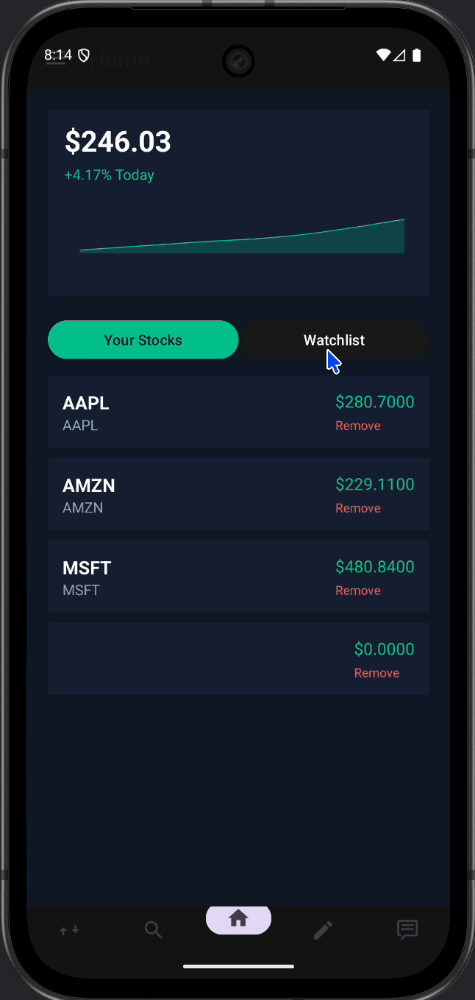
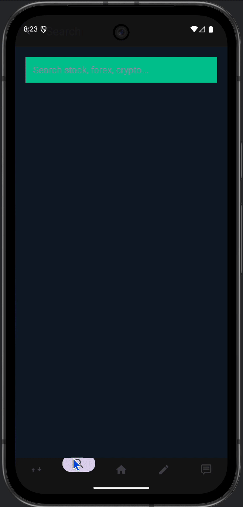
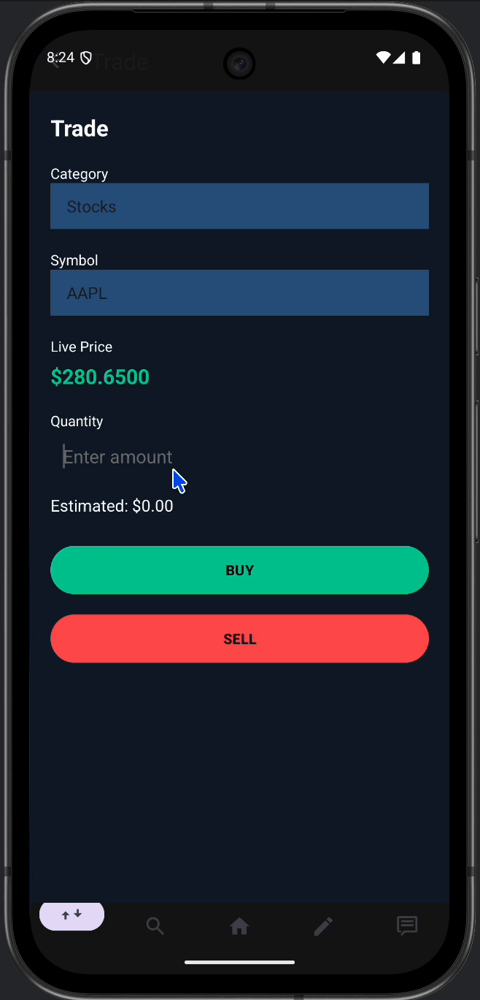
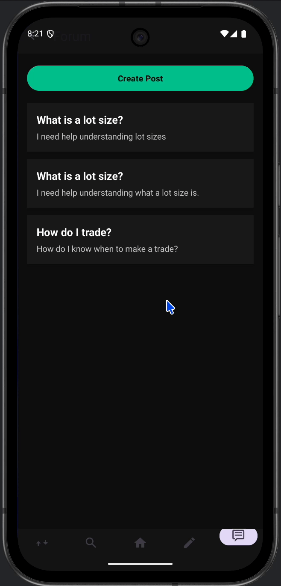

# Milestone 1 - PaperTrader (Unit 7)

## Table of Contents

1. [Overview](#Overview)
1. [Product Spec](#Product-Spec)
1. [Wireframes](#Wireframes)

## Overview

### Description

PaperTrader is a mobile app that simulates real-time stock trading with virtual money. It helps beginners learn how to trade, track portfolios, and understand the stock market without financial risk. The app also includes learning modules and a community forum where users can share tips and strategies in a simple, modern interface.

### App Evaluation

[Evaluation of your app across the following attributes]
- **Category:** Financial Literacy/Education

- **Mobile:** The app is designed for mobile use on Android devices. Users can access all trading and learning features from their phones at any time, allowing them to practice trading, read educational content, and engage with the community wherever they are.

- **Story:** PaperTrader began as a solution to a common challenge faced by new traders: the lack of an accessible, realistic, and easy-to-use demo trading app. Inspired by personal experience, the app helps users learn trading concepts, simulate stock investments, and connect with a community of peers without the financial risks of real markets. It combines a clean, modern interface with real stock data and interactive learning modules to make financial literacy practical and engaging.

- **Market:** The app targets beginner and intermediate investors, especially college students and young adults who are interested in learning how to trade. It also appeals to educators who want to incorporate stock trading simulations into financial literacy programs. PaperTrader fills a gap between overly complex trading platforms and overly simplified learning tools.

- **Habit:** Users are encouraged to build consistent trading habits by checking their portfolios daily, participating in community discussions, and completing short learning modules. The goal is to promote routine financial awareness and long-term investment education rather than impulsive or short-term trading.
- **Scope:** The project focuses on creating a fully functional Android app prototype with key features:
	•	Live stock data integration (using Yahoo Finance API)
	•	Buy/sell simulation with a virtual balance
	•	Portfolio tracking and watchlist functionality
	•	Educational modules on trading fundamentals
	•	A community forum for peer discussion
Future scope includes expanding to iOS, adding gamification (leaderboards, challenges), and enhancing data visualization tools for advanced analytics.

## Product Spec

### 1. User Features (Required and Optional)

**Required Features**

1. User Authentication
2. Dashboard/ Home Screen
3. Stock Data Display
4. Buy/Sell button
5. Portfolio Page
6. Basic Learning Modules 
7. Simple UX/UI Design
8. Favorite Stock buttons
9. User tracking (Day, Week, Month, Year)

**Optional Features**

1. Community-Forum
2. Advanced Learning Modules (Including Quizzes, videos, etc..)
3. Stock watchlist

### 2. Screen Archetypes

- **Login / Sign Up Screen**
  - Allows users to create an account or log in to save their portfolio, trades, and learning progress.
  - Connects to Firebase Authentication.
  - Leads to Home Dashboard after successful login.

- **Home Dashboard**
  - Displays total portfolio balance, daily gain/loss, and quick access to key tabs.
  - Shows featured stocks or market overview.
  - Allows users to navigate to Trading, Learn, or Community sections.

- **Trading Screen**
  - Displays real-time stock data (price, volume, chart view).
  - Allows users to search, buy, and sell stocks using virtual currency.
  - Includes visual indicators (green/red) for market trends.

- **Portfolio Screen**
  - Shows user’s current holdings, unrealized gains/losses, and transaction history.
  - Updates dynamically with each trade.

- **Learning Module Screen**
  - Interactive lessons on trading basics, stock terminology, and risk management.
  - Includes progress tracking and short quizzes.

- **Community Forum Screen**
  - Reddit-style discussion board for users to post, comment, and engage.
  - Categorized by trading topics and learning discussions.
  - Encourages user engagement and sharing strategies.

- **Settings / Profile Screen**
  - Allows users to toggle between light/dark mode.
  - Edit account information and set initial virtual balance.
  - Manage notification preferences.
### 3. Navigation

**Tab Navigation** (Tab to Screen)

* Home Dashboard  
* Trade  
* Learn  
* Community  
* Profile  

---

**Flow Navigation** (Screen to Screen)

- **Login / Sign Up Screen**
  - Home Dashboard  

- **Home Dashboard**
  - Trading Screen (when “Trade Now” button is pressed)
  - Learning Module Screen (when “Learn” tab is selected)
  - Community Forum Screen (via navigation bar)
  - Settings / Profile Screen (via profile icon)

- **Trading Screen**
  - Portfolio Screen (via “My Portfolio” button)
  - Stock Detail Screen (when selecting a stock)
  - Home Dashboard (via navigation bar)

- **Portfolio Screen**
  - Stock Detail Screen (for more info on holdings)
  - Home Dashboard (via navigation bar)

- **Learning Module Screen**
  - Quiz Screen (after completing a lesson)
  - Home Dashboard (via navigation bar)

- **Community Forum Screen**
  - Post Detail Screen (when selecting a post)
  - Create Post Screen (via “+” icon)
  - Home Dashboard (via navigation bar)

- **Settings / Profile Screen**
  - Home Dashboard (via back button)

## Wireframes

### Digital Wireframes & Mockups

 
 

# Milestone 2 - Build Sprint 1 (Unit 8)

## GitHub Project board

[Add screenshot of your Project Board with three milestones visible in
this section]

## Issue cards

- [Add screenshot of your Project Board with the issues that you've been working on for this unit's milestone] 
- [Add screenshot of your Project Board with the issues that you're working on in the **NEXT sprint**. It should include issues for next unit with assigned owners.] 

## Issues worked on this sprint

- List the issues you completed this sprint
- [Add giphy that shows current build progress for Milestone 2. Note: We will be looking for progression of work between Milestone 2 and 3. Make sure your giphys are not duplicated and clearly show the change from Sprint 1 to 2.]

 

# Milestone 3 - Build Sprint 2 (Unit 9)

## GitHub Project board

[Add screenshot of your Project Board with the updated status of issues for Milestone 3. Note that these should include the updated issues you worked on for this sprint and not be a duplicate of Milestone 2 Project board.] 

## Completed user stories

- List the completed user stories from this unit
- List any pending user stories / any user stories you decided to cut
from the original requirements

[Add video/gif of your current application that shows build progress]

## App Demo Video

- [Embed the YouTube/Vimeo link of your Completed Demo Day prep video](https://www.canva.com/design/DAG5vvl_ZLU/6kRIkTyTa4tVwstw3qHg7g/edit?utm_content=DAG5vvl_ZLU&utm_campaign=designshare&utm_medium=link2&utm_source=sharebutton)
